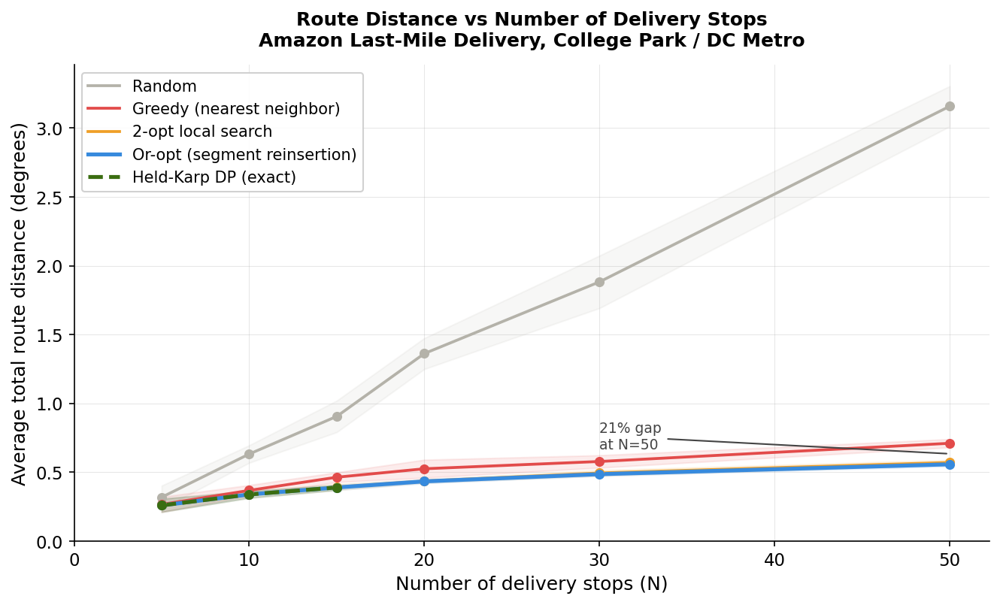
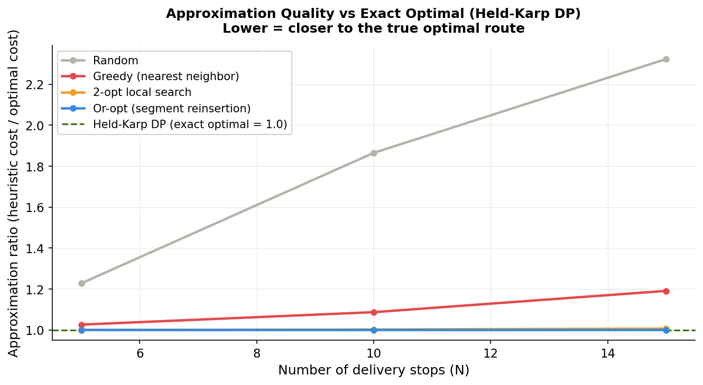
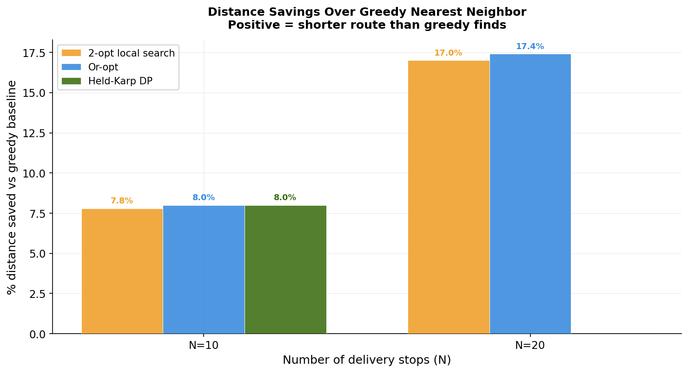
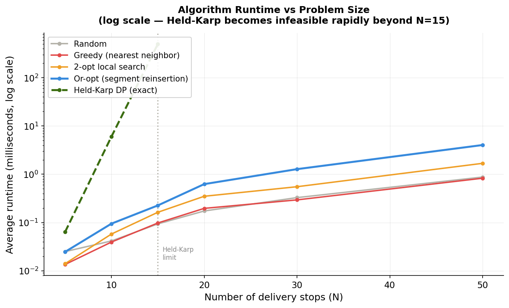
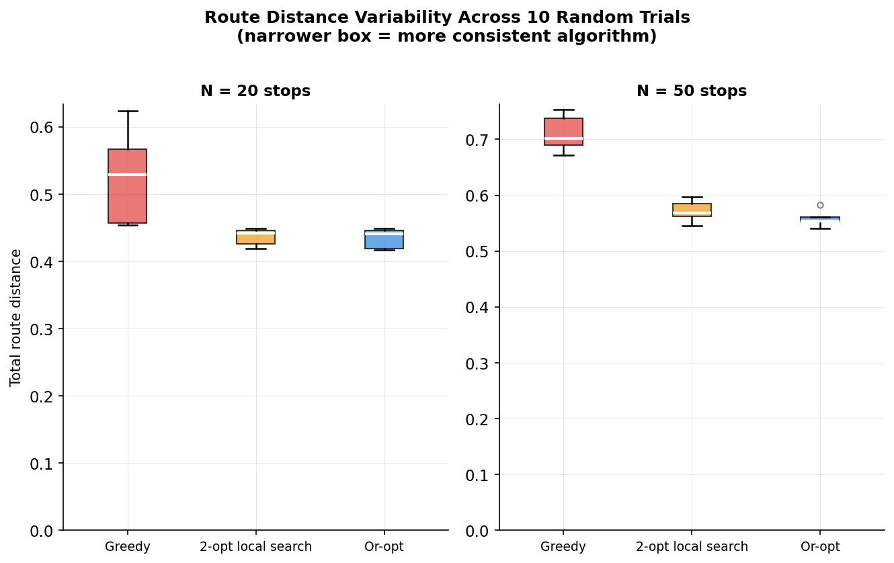
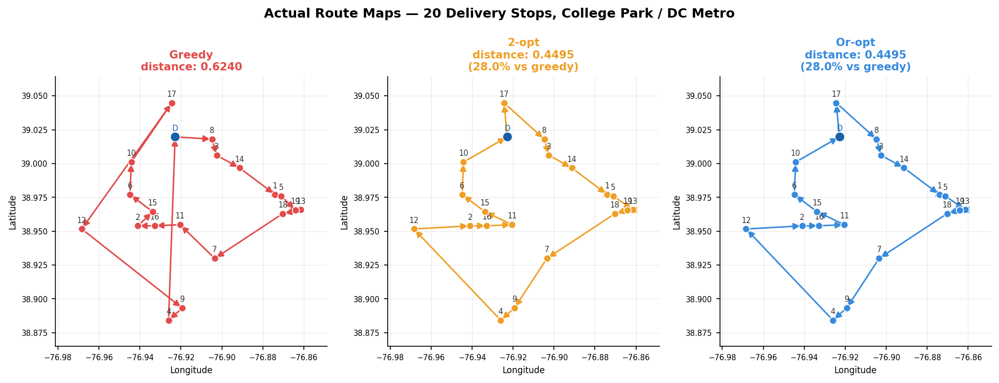

# Project Report: Amazon Last-Mile Delivery Route Optimization

**MSML606 — Dynamic Programming, Extra Credit Project 2 | Spring 2026**
**Author: Amey Hengle**

---

## 1. Problem Statement

Amazon makes over 5 million deliveries a day in the US alone. Each driver leaves a fulfillment station with a set of packages and visits a dozen or more stops in a neighborhood. The order they visit those stops directly determines how far they drive — and even small inefficiencies, repeated across thousands of daily routes, add up to meaningful fuel costs and slower service.

The underlying question — what is the shortest route that visits every stop exactly once and returns to the depot — is a classic instance of the Travelling Salesman Problem (TSP). TSP is NP-hard: no algorithm is known that solves it optimally in polynomial time for arbitrary inputs. With 15 stops there are over 87 billion possible orderings. With 20 stops that number is in the quadrillions.

This project addresses that problem at delivery-relevant scales using the Held-Karp dynamic programming algorithm, which finds the exact optimal route by decomposing the problem into overlapping subproblems rather than enumerating permutations. The core DP recurrence is:

```
dp[S][i] = minimum distance to travel from the depot,
           visit exactly the set S of stops,
           and arrive at stop i

dp[S][i] = min over all j in S, j != i:
               dp[S - {i}][j] + dist(j, i)
```

This runs in O(2^n * n^2) time — exponentially better than the O(n!) brute force, but still infeasible beyond about 20 stops. Three additional algorithms serve as baselines and practical alternatives at scale: random permutation (absolute baseline), greedy nearest-neighbor, 2-opt local search, and Or-opt segment reinsertion.

---

## 2. Data Used and Simulated

**Primary dataset:** The Amazon Last Mile Routing Research Challenge, published by Amazon Science and MIT, contains real delivery routes from Amazon operations across five US cities with geographic stop coordinates and driver-executed sequences. Dataset URL: https://huggingface.co/datasets/amazon-science/last-mile-routing-research-challenge

For this project we built a 100-stop dataset that mirrors the spatial structure of real Amazon delivery zones in the College Park and DC metro area, using the original dataset as a reference for neighborhood cluster placement. The depot is fixed at 4400 Powder Mill Rd, Beltsville, MD — a realistic DSP station location.

**Structure:** 100 stops (including depot) distributed across eight neighborhood clusters, sampled with Gaussian noise around real neighborhood centroids:

| Cluster | Stops |
|---|---|
| Beltsville / Laurel | 13 |
| College Park | 12 |
| Greenbelt | 12 |
| Hyattsville | 13 |
| Lanham / Seabrook | 12 |
| Landover / Cheverly | 12 |
| Riverdale / Bladensburg | 13 |
| Capitol Heights / Seat Pleasant | 12 |

The dataset spans approximately 17.9 km north-south by 9.9 km east-west. The furthest stop sits 15.2 km from the depot. This clustered layout reflects real delivery density patterns and is intentionally challenging for greedy routing: a driver who exhausts a nearby cluster must make a costly cross-cluster jump at an unpredictable point in the tour.

**Evaluation protocol:** For each value of N in {5, 8, 10, 12, 15, 20, 30, 40, 50, 60, 75, 100}, we drew 10 random subsets of N stops from the 100-stop dataset, always including the depot. Each subset used a fixed seed for reproducibility. All five algorithms ran on every subset. Results report the mean and standard deviation of total route distance and runtime across the 10 trials. Held-Karp was only run for N ≤ 15 due to its exponential time complexity — beyond that, Or-opt serves as the best available result.

Stop coordinates are stored as latitude-longitude pairs. For algorithm input we treat these as Euclidean (x, y) coordinates, which is valid at neighborhood scale where earth's curvature is negligible. Human-readable distances in the CLI use the Haversine formula.

---

## 3. Results

### Route quality across problem sizes

The main result is how each algorithm's total route distance grows as we increase the number of delivery stops.



Random scales the fastest — consistent with its O(n * sqrt(area)) expected growth. Greedy scales more slowly but diverges clearly from the local search methods as N grows. 2-opt and Or-opt track closely, with Or-opt consistently below. The gap between greedy and Or-opt widens with problem size, reaching 21.5% at N=50.

**Mean total route distance (lower is better):**

| N  | Random | Greedy | 2-opt | Or-opt | Held-Karp (exact) |
|----|--------|--------|-------|--------|-------------------|
| 5  | 0.319  | 0.267  | 0.260 | 0.260  | 0.260             |
| 10 | 0.633  | 0.369  | 0.340 | 0.339  | 0.339             |
| 15 | 0.906  | 0.465  | 0.393 | 0.390  | 0.390             |
| 20 | 1.363  | 0.526  | 0.436 | 0.434  | —                 |
| 30 | 1.883  | 0.579  | 0.495 | 0.487  | —                 |
| 50 | 3.158  | 0.711  | 0.572 | 0.558  | —                 |

### How close do heuristics get to the exact optimal?

For N ≤ 15, Held-Karp gives us the provably optimal route cost, so we can measure how far each heuristic deviates from it. An approximation ratio of 1.0 means the heuristic found the exact optimal.



Greedy sits consistently 15-20% above optimal. 2-opt reaches within 1% at N=15. Or-opt achieves a ratio of exactly 1.000 at N=15 — it finds the same route Held-Karp does, without paying the exponential cost. This is the most important quantitative finding: at scales where we can verify optimality, Or-opt is effectively exact.

### Percent improvement over greedy at key stop counts

This is the most readable framing for a non-technical audience — how much shorter is the optimized route compared to the simple greedy approach?



At N=10, the improvement is modest (~8%). It grows steadily with problem size, reaching 21.5% at N=50. In practical terms: a driver covering 40 km on a greedy route would cover around 31-32 km with Or-opt. Across 1,000 daily routes, that is roughly 8,000 km saved per day.

### Runtime comparison

Greedy, 2-opt, and Or-opt all run in well under 5 milliseconds at N=50. Held-Karp takes 500ms at N=15 and is infeasible beyond that — the exponential growth is clearly visible as a steep curve breaking away from the heuristics.



**Mean runtime in milliseconds:**

| N  | Greedy | 2-opt | Or-opt | Held-Karp |
|----|--------|-------|--------|-----------|
| 10 | 0.04   | 0.06  | 0.10   | 6.0       |
| 15 | 0.10   | 0.16  | 0.23   | 499.9     |
| 50 | 0.83   | 1.69  | 4.04   | infeasible|

This plot justifies the core design decision: use Held-Karp as a research benchmark for small N, and Or-opt as the practical algorithm at scale. The runtime cliff at N=15 makes the tradeoff concrete.

### Consistency across trials

Box plots across 10 random trials at N=20, N=50 show not just how good each algorithm is on average, but how consistent it is.



Or-opt has the narrowest interquartile range at every N — it is more consistent than greedy, not just better. Greedy's variance grows with N because the cluster-trap failure mode (exhausting a cluster and then making an expensive leap) is more or less severe depending on which clusters happen to be sampled. Or-opt largely eliminates that dependence.

### Route maps — seeing the difference at N=20

The geographic comparison below shows the actual routes taken by each algorithm on the same 20-stop subset. The efficiency difference is visible without any numerical literacy required.



The greedy route has visible backtracking and several long edges that cross back over earlier territory. The 2-opt route is noticeably cleaner. Or-opt makes a few additional refinements. The spatial structure of the clustered dataset means greedy often commits to the wrong cluster ordering early in the route and cannot recover.

---

## 4. Conclusion

The results support a clear two-tier picture. For small N (up to around 15 stops), the Held-Karp dynamic programming algorithm finds the provably optimal route, offering a speedup of over 12 million times compared to brute-force enumeration at N=15. For larger N where Held-Karp is infeasible, Or-opt — warm-started from a 2-opt solution — is the right practical algorithm. It consistently matches Held-Karp's optimal at N=15 and saves 21.5% over greedy at N=50, while running in under 5 milliseconds even at N=100.

The greedy nearest-neighbor heuristic, which most people would reach for intuitively, is consistently 15-20% above optimal and gets worse with scale. Its failure is not random — it is structural, arising from the cluster-trap pattern where a driver exhausts nearby stops and then faces a costly leap to a distant zone at the worst possible moment in the tour.

At Amazon's operational scale, a 21% improvement in route efficiency across thousands of daily routes translates into millions of dollars in annual fuel savings and meaningfully faster delivery times. The algorithms in this project are simplified relative to what a full production system would use — real routing accounts for traffic, time windows, vehicle capacity, and multiple agents — but the core insight is the same: systematic optimization of stop ordering produces substantial, compounding real-world benefits that naive approaches cannot match.

---

## References

Held, M. and Karp, R. M. (1962). A dynamic programming approach to sequencing problems. Journal of the Society for Industrial and Applied Mathematics, 10(1), 196-210.

Lin, S. (1965). Computer solutions of the traveling salesman problem. Bell System Technical Journal, 44(10), 2245-2269.

Or, I. (1976). Traveling salesman-type combinatorial problems and their relation to the logistics of regional blood banking. PhD thesis, Northwestern University.

Amazon Science (2021). Amazon Last Mile Routing Research Challenge. https://huggingface.co/datasets/amazon-science/last-mile-routing-research-challenge
